# Task

Although being pretty clear, the original formulation of the task leaves open what the optimality criterion is for handling conflicts. Hence, the following more specific definition is used:

* Given a set of **exercises**.
* Given a list of **chains** of exercises of ascending **difficulty**,
	* each link of the chain representing a difficulty **inequality** by capturing that the prior exercise $A$ is easier than the subsequent exercise $B$,
	* each inequality between $A$ and $B$ possibly occurring *multiple* times.
* Given a *subset* of exercises which are **requested** to be *ordered* by ascending difficulty.
* Provide an **optimal order** of these requested exercises, such that
	* each difficulty inequality of the given chains is treated as a **constraint** to be fulfilled,
	* the number of **violated** constraints is minimal.

# Approach

The task is solved along the following three steps.

* Based on the input, **construct** the **inequality graph**. Each exercise becomes a vertex and each constraint `A < B` becomes a directed edge from exercise `A` to `B`.
	* Note that the graph is a *multi-graph* because the same constraint might be provided multiple times in the inequality chains.
* **Remove** the exercises that are **not requested** for the result order.
	* The edges of a removed exercise are **shortcut** with its adjacencies. More specifically, when removing exercise `B` which has an incoming edge `A < B` and an outgoing edge `B < C`, a new edge `A < C` is added to the inequality graph.
	* Such shortcutting also considers multiple edges. For example, if `B < C` occurred twice, then `A < C` would also be added twice.
* Iteratively identify the **easiest** exercise, **append** it to the **solution** and **remove** it from the inequality graph.
	* Easiest means that the exercise has a minimal number of incoming edges. Outgoing edges act as tie-breaker here, which are maximized.
	* When removing the exercise, its adjacencies are **not shortcut**. Instead, all of its incoming edges become violated constraints.

Note that the last step corresponds to [Kahn's algorithm](https://en.wikipedia.org/wiki/Topological_sorting#Kahn's_algorithm) with the catch that there are not necessarily vertices without incoming edges. Instead, the proposed approach introduces a *metric* ("easiest") to identify which vertex should be chosen in such a case. This metric *greedily* minimizes violated constraints (incoming edges) while trying to unblock the maximum number of exercises (using outgoing edges as a tie-breaker). The **heuristic** does not necessarily lead to an *optimal solution*. See the section about [complexity](#complexity) for the motivation why this is justified.

The approach is illustrated for three examples in the following. They are taken from the challenge input data.

## Example (Challenge 2)

The following figure shows the graph of challenge 2. Note that handling multi-graphs is a must here because of the two edges `E < C`. There are two strongly connected components, namely `ABCDE` and `FGH` and the first needs to come strictly before the second because of `E < F`.

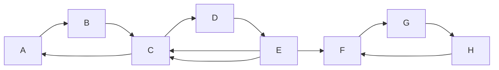

In the challenge, the order is requested without `C` and `H`. Hence, the incoming and outcoming edges of these vertices are shortcut. For example, `B < C` and `C < A` leads to a new edge for `B < A`. This also applies to vertex pairs that have multiple edges between them. For example, the two `E < C` together with `C < A` and `C < D` lead to two `E < A` and `E < D` each.

The overall result is shown in the following graph. There are still two strongly connected components, namely `ABDE` and `FG` and the first still comes strictly before the second because of `E < F`.

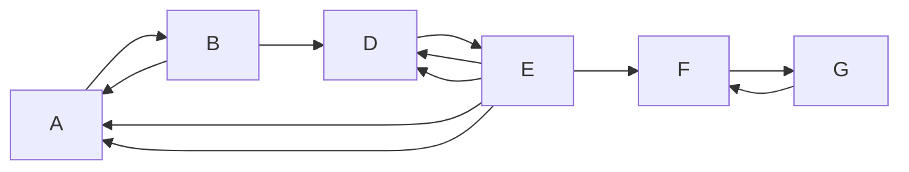

There are three direct cycles between pairs of vertices, namely between `AB`, `DE`, and `FG`. So any solution will at least violate three constraints. In addition, the cycle between `DE` is unbalanced with `E < D` occuring twice and `D < E` only once. This means that `D < E` is the preferred candidate for breaking the cycle as it would only violate one constraint (instead of two). For `AB` and `FG`, any edge can be chosen to break the cycle.

Let us see whether the proposed heuristic comes to the same conclusion.

First, `E` is identified as easiest because it ties others having only one incoming edge (*incoming degree* $1$) but has a maximal number of outgoing edges (*outgoing degree* $5$). It is added as the first exercise in the solution. Furthermore, it is removed from the graph without shortcutting its adjacencies. We note `D < E` as a violated constraint, which is exactly the preferred candidate as stated above. This leads to the following graph.

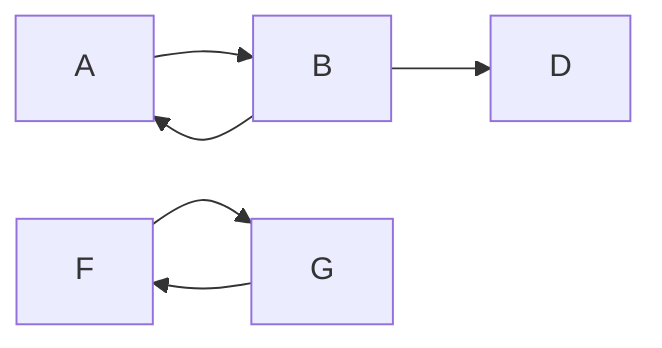

In the next iteration, exercise `B` is added to the solution because it ties others with an incoming degree $1$ but has a maximum outgoing degree of $2$. This violates constraint `A < B`. The result is as follows.

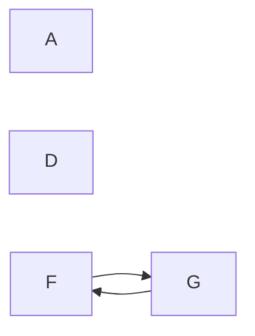

For the first time, there are now exercises without incoming edges. Both `A` and `D` are isolated. In the examples, we use the lexicographic order for such complete ties. This leads to the following graph.

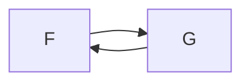

Both `F` and `G` have an incoming and outgoing degree of $1$, so we select `F` and finally `G`.

This leads to the following solution:
* Order: `E B A D F G`
* Violated constraints (3):
	* `D < A`
	* `A < B`
	* `G < F`

The solution is optimal as we have already seen that any solution has at least three violations.

## Example (Challenge 3): Disconnected Graphs

Inequality graphs are not necessarily connected. For example, as shown in the following figure, the graph of challenge 3 has three disjoint vertex sets that are unrelated to each other.

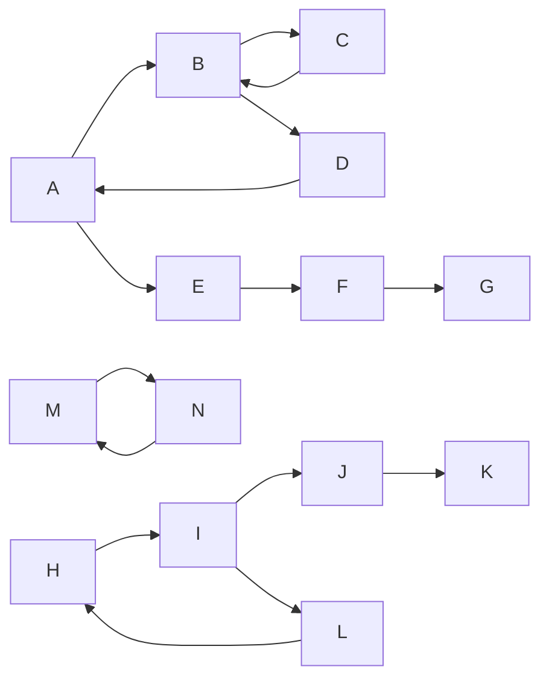

There are three strongly connected components `ABCD`, `MN`, and `HIL`. For the first one, there are even two seperate cycles `ABD` and `BC`. Consequently, any optional ordering will violate exactly four constraints. As there are no multi-edges (inequalities occuring multiple times), there is no strictly preferred means of breaking the cycles.

In the first iteration, exercise `A` or `I` could be selected because they tie others regarding the minimal number of incoming edges (*incoming degree* $1$), while having the maximum number of outgoing edges (*outgoing degree* $2$). Let `A` be selected and its incoming edge `D < A` be added to the list of violated constraints. The following figure shows the result after `A` is removed.

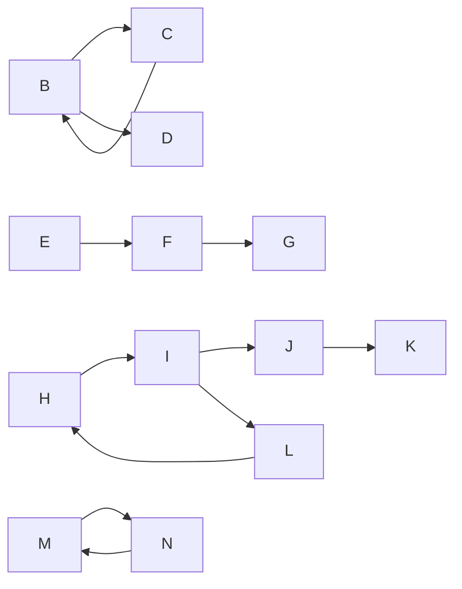

The next iterations operate along Kahn's algorithm an provide `E F G` in this order. This leads to the point where there are again no exercises without incoming edges. Now `B` and `I` tie with incoming degree $1$ and outgoing degree $2$. Let `B` be selected and `C < B` be added to the violations. The result is shown in the next figure.

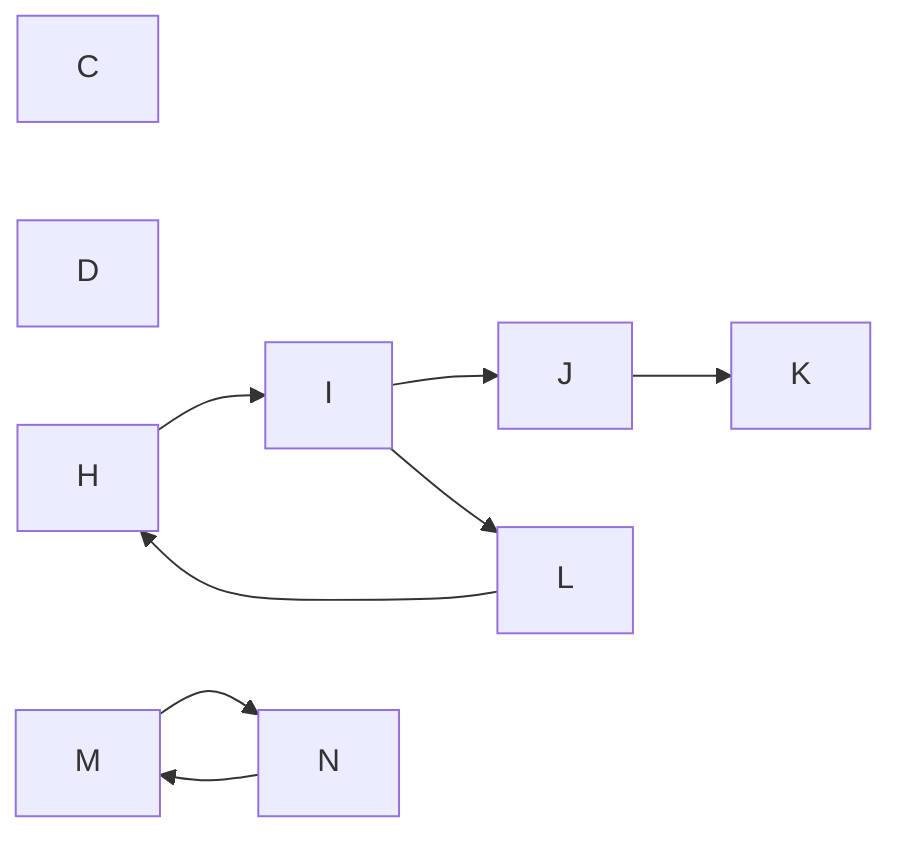

Removing `C` and `D` leads again to the point where there are no exercises without incoming edges. This time exercise `I` is the only one that has an incoming degree $1$ and outgoing degree $2$. Hence, it is selected in the next iteration and the violation `H < I` is added. The figure shows the result after having removed `I`.

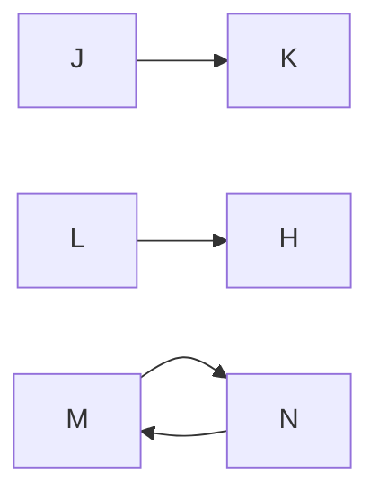

The next four iterations remove exercises `J L H K` that have no incoming edges at the time of selection. Note that, after having removed `J`, exercise `L` comes before `K` because its outbound degree is $1$. This leaves `M` and `N` in a direct cycle. Any can be selected as both have the same incoming/outgoing degree. So let us assume that `M` is taken first and `N` last.

This leads to the following solution:
* Order: `A E F G B C D I J L H K M N`
* Violated constraints (4):
	* `D < A`
	* `C < B`
	* `H < I`
	* `N < M`

The solution is optimal as we have already seen that any solution has at least four violations.

## Example (Challenge 4): Contradictions Only on Not Requested Exercises

As a final example, it is demonstrated that it is vital to remove exercises that are not requested at the beginning. The graph of challenge 4 is taken as starting point.

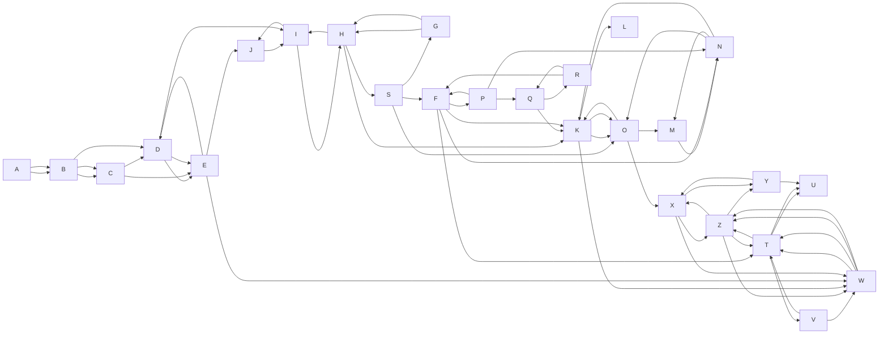

The graph is fraud with cycles. However, only the exercises `B W I N F` are requested. The layout of the graph hints a possible solution `B I F N W`. But let us see the outcome of the proposed approach.

At first, all not requested exercises are removed and their adjacencies are shortcut (for a step-by-step example, see [above](#example-challenge-2)). This leads to the following graph. It shows multi-edges as one edge that has the edge count as attribute.

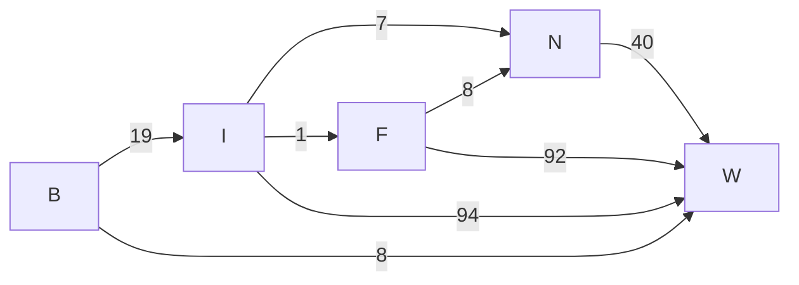

The result is an acyclic graph. Hence, the heuristic operates along the lines of Kahn's algorithm and finds the optimal solution `B I F N W`.

# Complexity

The given task corresponds to finding the minimal [feedback edge set](https://en.wikipedia.org/wiki/Feedback_arc_set) of a directed graph. More specifically, the feedback edges are the violations of the original inequalities which need to be kept at a minimum.

Determining whether the cardinality $k$ is achievable for the feedback edge set was [proven to be NP-hard](https://en.wikipedia.org/wiki/Feedback_arc_set#NP-hardness). While being an improvement over the $O(n!)$ of a brute force solution, the best known exact solution still needs [exponential time](https://en.wikipedia.org/wiki/Feedback_arc_set#Exact). Hence, it is justified to have proposed and used a heuristic that might provide results that are not optimal.

The complexity of heuristical approach is as follows:
* Let $n$ denote the number of exercises (vertices) and $p$ the number of inequality pairs (edges) between them.
* Constructing the original graph as double-linked adjacency multi-sets is done in $O(n+p)$, if we assume hash set operations in $O(1)$.
* In order to remove the exercises to be ignored in the solution, $O(n)$ exercises need to be removed and their incoming and outgoing edges to be shortcut in $O(n\cdot p)$ each. This leads to a total of $O(n^2 \cdot p)$.
* For the $O(n)$ remaining exercises, one is selected and removed after the other. It costs $O(n)$ to select each of them and $O(n\cdot p)$ to remove its edges. So, in total, constructing the order needs $O(n^2 \cdot p)$.

In conlusion, the overall time complexity is $O(n^2 \cdot p)$, which is not critical for input sizes of $n \le 26$ and $p \le 65$.

# Class Diagram

To keep the diagram clearly arranged, some simplifications are applied:
* The generic `MultiSet<T>` class is only shown for `MultiSet<Exercise>`. The `InequalityPair`'s use of it for `MultiSet<InequalityPair>` is only shown by its to-`*` compositions `violations` and `constraints`.
* The `Comparable<T>` implementation of `Exercise` and `InequalityPair` is not shown as relationship but only hinted by the implementation of `compareTo`.
* The parameter names of `OrderOptimizer`'s `execute` and `InequalityGraph`'s constructor are shortened.
* Parameter names are only shown if they provide valuable information beyond their type.

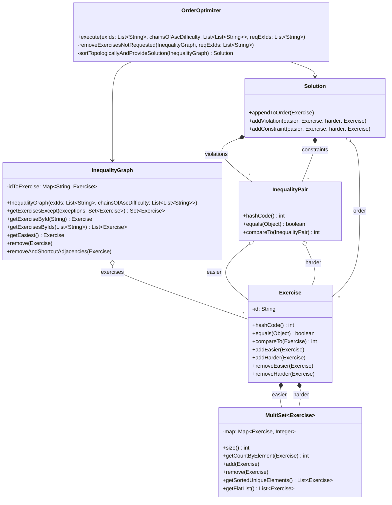

# Results

No runtime measurements are provided here because each run finishes within a few milliseconds.

The following table summarizes the output to the solutions. Note that:
* Solutions without violations are obviously optimal (applies to `0`, `1`, and `4`).
* Solutions to `2` and `3` are optimal as we have already seen [here](#example-challenge-2) and [here](#example-challenge-3).

| Challenge | Solution | # Constriants | # Violations |
| -- | -- | --: | --: |
| `schwierigkeiten0` | `B E D F C` | 7 | 0 |
| `schwierigkeiten1` | `A C G F D` | 7 | 0 |
| `schwierigkeiten2` | `B E A D F G` | 11 | 3 |
| `schwierigkeiten3` | `A E F G B C D H I J K L M N` | 15 | 4 |
| `schwierigkeiten4` | `B I F N W ` | 269 | 0 |
| `schwierigkeiten5` | `H R Z Q K B W C S E N A G` `I Y J L M O F V D P X U T ` | 43 | 9 |
