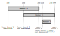

# Task

As the task is not formulated very clearly in the exercise, the following formulation is used.
* Given a set of members and, for each of them, an interval for which distances he would participate in the excursion,
* find three distances
* for which the total number of members (who could participate in at least one of them) is optimal.

# Choosing Candidate Distances

A **candidate distance** is an excursion distance which is considered for the selection of the three distances in which the excursion takes place.

For the remainder, $n$ denotes the number of members eligible to participate in the excursion. Each of them has submitted his lower bound and upper bound (both inclusively) of what would be acceptable distances. This means that there are also exactly $n$ lower and upper bounds respectively.

The **naive approach** consists of regarding each distance from the *minimum of the lower bounds* up to the *maximum of the upper bounds* as candidates. The number of such distances is denoted by $r$ and is expected to be much higher than $n$, so $r \gg n$. For example, in case of two members and their intervals $[100, 200]$ and $[150, 250]$, all distances between $100$ and $250$ would be considered as candidates, leading to $r=151$.

A better approach consists of considering **all lower bounds** as candidates (or, alternatively, all upper bounds). Then, there are exactly $n$ candidates. This is sufficient because, in the example above, any distance between $150$ and $200$ would lead to exactly the same set of participants. So, by convention, coming from lower distances and gradually moving up, we identify each lower bound as a distance for which the set of participants increases and the distance could potentially be part of the solution.

A further improvement is to **eliminate** all the candidates that are **dominated** by another candidate. Being based on lower bounds, we identify that a candidate is dominated by evaluating whether there is no upper bound (of any member) between the candidate and the next lower bound (in ascending order). To illustrate this, the figure expands above example by adding a third member whose preference is $[210, 240]$. The candidate distance $100$ is dominated by $150$ as there is no upper bound in between. Hence, the set of participants for $150$ is a superset of the one for $100$, thus meaning that $100$ is dominated by $150$. Contrarily, the lower bound $150$ of member 1 and the lower bound $210$ of member 2 are followed by upper bounds, so both qualify as candidates. Note that, by sorting the candidates, the evaluation of dominated candidates can be done in $O(n\log n)$. For a random distribution of lower and upper bounds, the number $c$ of such **undominated** candidates is expected to be about half the number of candidates, so $c=\frac{n}{2}$.

# Complexity

For an analysis of time complexity, only the brute force search of the triple of distances is relevant. For each of these triples, the sets of participants of the three distances is unioned, which is in $O(n)$. The constant factor of this is kept low by pre-evaluating the participant set for each distance in advance.

The decisive factor is the number of candidates. The complexities for each approach are:
* *Naive approach*: $O(r^3 \cdot n)$
* *All lower bounds*: $O(n^4)$
* *Undominated lower bounds*: $O(c^3 \cdot n)$
	* For $c=\frac{n}{2}$, this also leads to $O(n^4)$. But at least a speedup of factor $8$ is expected.

# Time Measurements

By carefully choosing the **candidates** for excursion distances (and eliminating unnecessary ones), the runtime is drastically cut down. The effect is even greater than expected after the discussion of time complexities: Based on the input data, the number of undominated lower bounds is smaller than the half of all lower bounds, thus leading to speedups above the expected $2^3=8$.

The following table shows three approaches of choosing **candidates** and their runtime (in seconds) for each input file.

| Input file | naive approach | all lower bounds | undominated lower bounds |
| -- | --: | --: | --: |
| `wandern1.txt` | .042 | .001 | .001 |
| `wandern2.txt` | .039 | .001 | .001 |
| `wandern3.txt` | .038 | .001 | .001 |
| `wandern4.txt` | 247.748 | .339 | .054 |
| `wandern5.txt` | > 3600.000 | 5.352 | .434 |
| `wandern6.txt` | > 3600.000 | 174.971 | 10.537 |
| `wandern7.txt` | > 3600.000 | 1324.838 | 96.055 |
