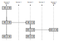

# Task

As some aspects are not stated clearly in the exercise, the following task definition is used:
* Given a corridor consisting of *n* sections, each of which is closed and open during a section-specific and regular time period *p*.
	* More specifically, it is closed in $[0,p)$ then open in $[p,2p-1)$ then closed in $[2p,3p-1)$ then open in $[3p,4p-1)$ and so on...
* Find the sequence of steps through the corridor (to the tomb) which is optimal in the following sense:
	* The time needed to the tomb is minimal.
	* *(as a tie-breaker)* The number of steps is minimal.
* Whereas
	* Movement across sections *does not take any time*, even not for multiple sections at once.
	* It is allowed to move back to former sections.
	* The notion of step corresponds to the notion of *instructions* in the original exercise text - each instruction of the output describes one step.

# Approach

The given challenge is formalized in a graph. Parts of the graph are then simplified in order to remove superfluous steps. Finally, [Dijkstra's algorithm](https://en.wikipedia.org/wiki/Dijkstra%27s_algorithm) is used to find the optimal solution through the graph to the destination.

## Graph of Statuses and Transitions

Each vertex of the graph is a **status**, comprising both the current time and section. The corridor's sections are denoted by  numbers from $1$ to $n$ which leaves place for the start "section" $0$ and the destination "section" $n+1$ at which the tomb is found. The name of each status follows the notation `[ time / section ]`. Each edge of the graph is directed and presents a **status transition**.

The graph of such statuses and transitions is constructed recursively according to the priority induced by the optimality criteria (minimal time and minimal step count) until the tomb section is reached:
* The status `[ 0 / 0 ]` is a vertex.
* For each status `[ t / s ]`, the possible subsequent statuses are derived as follows:
	* `MOVE`: Any status `[ t / s-1 ]` or `[ t / s+1 ]` as long as the section $s-1$ or $s+1$ is open at the time $t$.
	* `WAIT`: The earliest status `[ t* / s ]` for which any neighboring section ($s-1$ or $s+1$) changes from closed to open, as long as the section $s$ itself remains open during the time frame from $t$ to $t*$.

An example graph is illustrated in the figure for the first example input (`grabmal0.txt`). The corridor consists of three sections. Its periods are $5$, $8$, and $12$ respectively. The transitions are calculated as follows:
* Status `[ 0 / 0 ]`: At time $0$, section $1$ is still closed, hence no `MOVE` is possible. The earliest time a neighboring section opens is $5$. As section $0$ remains open all the time, this means that a `WAIT` to `[ 5 / 0 ]` is possible.
* Status `[ 5 / 0 ]`: At time $5$, section $1$ is open. So `MOVE` to `[ 5 / 1 ]` is now an option. On top of that, a `WAIT` until time $15$ (when section 1 will open again) to `[ 15 / 0 ]` is the other option.
* Status `[ 5 / 1 ]`: Section $2$ is still closed. A `MOVE` back to `[ 5 / 0 ]` would be possible but this status has already been seen. Section $2$ opens at time $8$. Until that time section $1$ will remain open so a `WAIT` to `[ 8 / 1 ]` is possible. Note that section $0$ remains open all the time so it does not provide an alternative time for waiting.
* Status `[ 8 / 1 ]`: A `MOVE` to `[ 8 / 2 ]` is now possible. In addition, `[ 8 / 0 ]` is also a valid subsequent status for `MOVE`. For `WAIT`, the neighboring section will only open again at $24$ which is too late for section $1$ closing at time $10$.
* Status `[ 8 / 0 ]`: Does not do anything, as the only subsequent statuses `[ 8 / 1 ]` and `[ 15 / 0 ]` are already added. For clarity reasons (especially for the subsequent simplifications), this status is not depicted in the figure.
* Status `[ 8 / 2 ]`: There is no option to `MOVE` as `[ 8 / 1 ]` is already added and section $3$ is still closed. For `WAIT`, the neighboring sections will open at $15$ and $12$ respectively. Both of these options occur before section $2$ closes again so their minimum $12$ is taken for the subsequent status `[ 12 / 2 ]`.
* Status `[ 12 / 2 ]`: Section $3$ is now open so a `MOVE` to `[ 12 / 3 ]` is now an option. There is no other option to move because section $1$ is closed. In addition, `WAIT` to `[ 15 / 2 ]` is possible now as section $1$ will open at $15$, long before section $3$ re-opens at $24$.
* Status `[ 12 / 3 ]`: Section $4$, the tomb, is always open. So the destination `[ 12 / 4 ]` can now be reached by a `MOVE`.

At this time, the algorithm stops. Any further status in the priority queue remains un-evaluated, as indicated in the figure.

## Simplification 1: Consolidating Wait-Move-Wait Sequences

Although the constructed graph allows for finding a path which is time-optimal, the number of statuses along the path is not necessarily minimal. In the example above, `WAIT` until `[ 8 / 0 ]` and then `MOVE` to `[ 8 / 1 ]` would lead to a sequence consisting of one step less. This is illustrated in the following figure.

To obtain the depicted graph, sequences of `WAIT-MOVE-WAIT` need to be replaced by a mere `WAIT-MOVE`. But this is not generally allowed because the section of the first `WAIT` might close before the final `MOVE` is available. So the following more elaborate evaluation is needed before actually consolidating such sequences:
* Let the `WAIT-MOVE-WAIT` sequence occur between the statuses `[ t / s ]`, `[ t* / s ]`, `[ t* / s* ]`, and `[ t** / s* ]`.
* Check that section $s$ remains open between the times $t$ and $t^{**}$. Abort the simplification if this is not the case.
* Check that all sections between $s$ and $s^*$ are open at the time $t^{**}$. Again, abort the simplification if this is not the case.
* Add a new status `[ t** / s ]` connected by transitions from `[ t / s ]` and to `[ t** / s* ]`. Status `[ t* / s ]` and `[ t* / s* ]` can be dropped if they are no predecessors of other statuses.

Note that, in the example, this simplification can be performed between `[ 0 / 0 ]` and `[ 8 / 1 ]` because section $0$ stays open all the time and section $1$ will still be open at time $8$.

## Simplification 2: Consolidating Wait-Wait and Move-Move Sequences

The second even more obvious simplification is to consolidate repeated `WAIT` or `MOVE` into one single transition. In our example, the following figure shows the result of consolidating twice the sequence `MOVE-MOVE` (from `[ 8 / 0 ]` to `[ 8 / 2 ]` and from `[ 12 / 2 ]` to `[ 12 / 4 ]`).

Contrarily to the consolidation of `WAIT-MOVE-WAIT`, there are obviously no preconditions for this simplification. Again, the intermediate statuses can be dropped if they become superfluous.

# Refined Graph Construction

It would be wrong to construct the basic graph first and to apply the simplifications afterwards. This would lead to distorted priorities of the statuses and, potentially, to sub-optimal solutions.

Instead, whenever adding a new transition, both simplification options are checked before actually adding the transition and the subsequent status to the graph. In our example, this means the following:

* When `[ 8 / 1 ]` is about to be added, the resulting `WAIT-MOVE-WAIT` is identified. So instead of setting `[ 5 / 1 ]` as its predecessor, the new intermediate status `[ 8 / 0 ]` is created and linked between `[ 0 / 0 ]` and `[ 8 / 1 ]`.
* When `[ 8 / 2 ]` is about to be added, the resulting `MOVE-MOVE` is identified. `[ 8 / 0 ]` will become the predecessor of `[ 8 / 2]`.

Note that it is not necessary to check recursively for further simplifications. If every addition of statuses only simplifies the end of the sequence, the overall sequence will also be fully simplified.

# Class Diagram

# Results

## Optimal Times

| Corridor | Optimal time to tomb / minutes |
| -- | --: |
| `grabmal0.txt` | 12 |
| `grabmal1.txt` | 49 |
| `grabmal2.txt` | 490021 |
| `grabmal3.txt` | 35 |
| `grabmal4.txt` | 3432897 |
| `grabmal5.txt` | 43965990 |

## Step Counts

The step count is the number of statuses minus one. It is only a tie-breaker criterium for the optimal time to the tomb. The following table shows the optimal number of steps for each corridor, under the constraint that these steps lead to the tomb in optimal time. It distinguishes between different degrees of simplifications that can be applied to the status graph.

| Corridor | Basic graph | Consolidating `WAIT-MOVE-WAIT` | Consolidating `WAIT-WAIT` and `MOVE-MOVE` | Fully simplified graph |
| -- | --: | --: | --: | --: |
| `grabmal0.txt` | 7 | 6 | 6 | 4 |
| `grabmal1.txt` | 16 | 15 | 12 | 10 |
| `grabmal2.txt` | 16 | 15 | 12 | 10 |
| `grabmal3.txt` | 22 | 20 | 6 | 4 |
| `grabmal4.txt` | 95 | 39 | 12 | 8 |
| `grabmal5.txt` | 3826 | 3787 | 88 | 56 |

## Runtime Measurements

Execution times in milliseconds.

| Corridor | Execution time / s |
| -- | --: |
| `grabmal0.txt` | .003 |
| `grabmal1.txt` | .001 |
| `grabmal2.txt` | .001 |
| `grabmal3.txt` | .001 |
| `grabmal4.txt` | .014 |
| `grabmal5.txt` | .187 |
